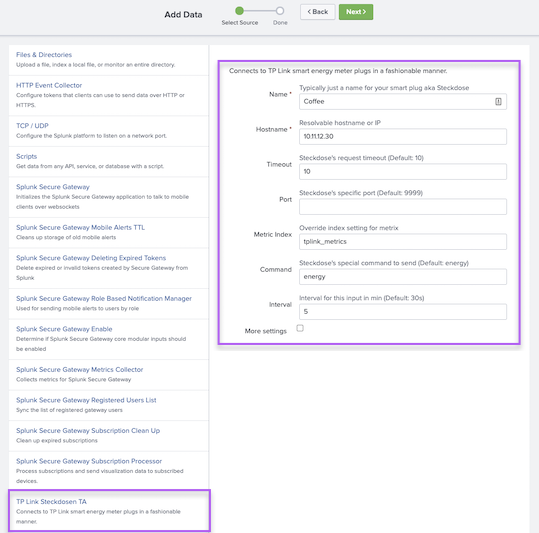

# TPLink_Steckdosen_TA
TPLink_Steckdosen_TA for Splunk (HS110 und KP115)
This app runs a python script to collect energy meter data from TP Link smart wlan plugs with energy meters and puts this data in to the metric index in Splunk. The app contains a modular input to configure data collection and a simple example dashboard based on the metrics. <p>
It is based on a script from this project: https://github.com/softScheck/tplink-smartplug and uses some props/transforms to put energy meter data in to the Splunk metric index and a Splunk Modular input to configure and run it. 


### Download and installation:
* If you download a release https://github.com/bautt/TPLink_Steckdosen_TA/releases/ it will unpack as "TPLink_Steckdosen_TA".  
* Move the app in to $SPLUNKHOME/etc/apps or use Splunk web Ui to upload and install. Restart. :rocket:

## Configuration
Once installed you can go to  "Settings" > "Data inputs" > "TP Link Steckdosen TA" and configure a modular input for each smart plug.
 
 * If you want to collect data from Universal Forwarders: configure it on the server and deploy the app to UF. 
 ** Or create inputs.conf manually, see following example stanza: 
 
```  
 [tplinksteckdosenta://Coffee]
 host = Coffee
 hostname = 10.11.12.30
 sourcetype = tplink_metrics
 timeout = 10
 tpsinterval = 5
 tpsmindex = tplink_metrics
 disabled = 0
 
``` 
## Usage
 Use Analytics Workspace to create charts. If you provided a meaningful name in the modinput configuration, you can use it as a dimension (split by inputname).
 
  


 
## Support

This app is not officially supported by Splunk and is provided as is.

## License

[Apache License 2.0](LICENSE.md)

*This app will create 2 new indexes (tplink_metrics and tplink_events)*

**Do not install on production systems**


###### Authors: Tomas Baublys /  Andreas Greeske
